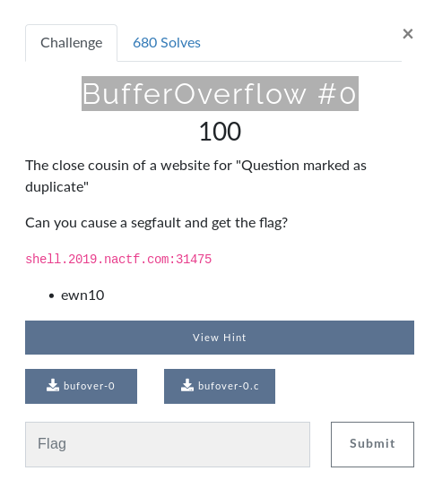
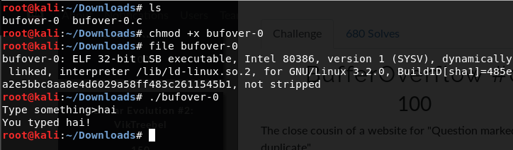
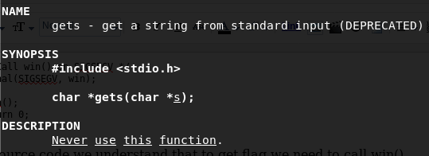
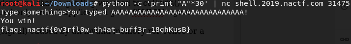

This is a writeup on how i solved **BufferOverflow #0** from NACTF. I hope this will help beginners in binary exploitation while doing ctfs. This is a Beginner level challenge.

**CTF : https://www.nactf.com/**

#### Lets start..

Download the binary to our system, make it executable and run the binary.

This binary is just printing the input back to us, behaving like a echo program.

Lets analyse the source code of this binary to know how it is working.

Here is the source code:
~~~
#include <stdio.h>
#include <signal.h>
void win()
{
    printf("You win!\n");
    char buf[256];
    FILE* f = fopen("./flag.txt", "r");
    if (f == NULL)
    {
        puts("flag.txt not found - ping us on discord if this is happening on the shell server\n");
    }
    else
    {
        fgets(buf, sizeof(buf), f);
        printf("flag: %s\n", buf);
    }
}
void vuln()
{
    char buf[16];
    printf("Type something>");
    gets(buf);
    printf("You typed %s!\n", buf);
}
int main()
{
    /* Disable buffering on stdout */
    setvbuf(stdout, NULL, _IONBF, 0);
    /* Call win() on SIGSEGV */
    signal(SIGSEGV, win);
    vuln();
    return 0;
}
~~~

From source code we will understand that to get flag we need to call win().

But  win() function is called only once if the application get a SISEGV signal.

A **SIGSEGV** is an error(signal) caused by an invalid memory reference or a segmentation fault. 

So the vuln() function is executing first. vuln() using gets() which is very dangerous as you can see that on man page of gets.

The buffer size is 16.

I am giving  30 'A' s to this binary. so definitely there will be a segmentation fault, win() function will get executed. we will get our flag. :)

Lets do that.

We got the flaaaaaag :)
