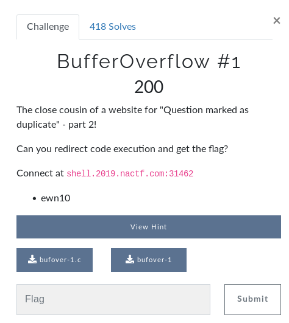
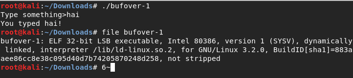
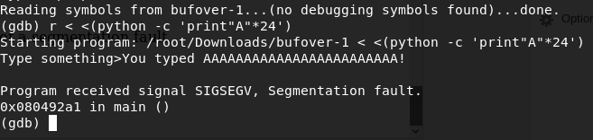
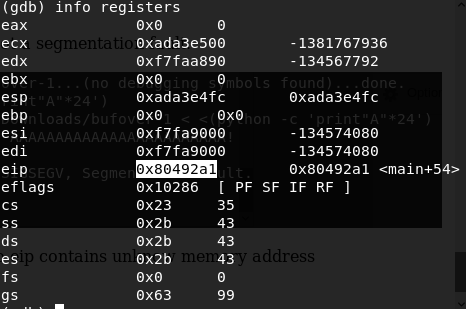
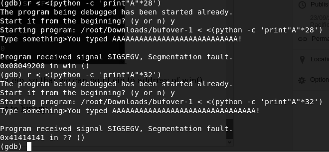
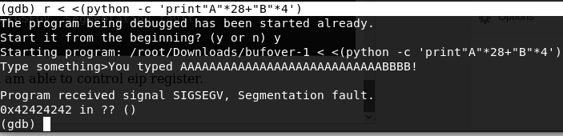
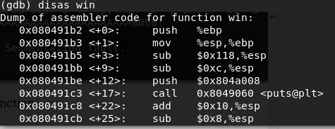
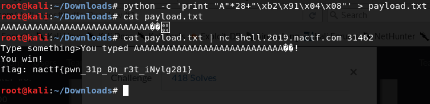

This is a writeup on how i solved **BufferOverflow #1** from NACTF. I hope this will help beginners in binary exploitation while doing ctfs. This is a Beginner level challenge.

**CTF : https://www.nactf.com/**

#### Lets start..

Download the binary to our system, make it executable and run the binary.

This binary is just printing the input back to us, behaving like a echo program.

Lets analyse the source code of this binary to know how it is working.

Here is the source code:
~~~
#include <stdio.h>

void win()
{
    printf("You win!\n");
    char buf[256];
    FILE* f = fopen("./flag.txt", "r");
    if (f == NULL)
    {
        puts("flag.txt not found - ping us on discord if this is happening on the shell server\n");
    }
    else
    {
        fgets(buf, sizeof(buf), f);
        printf("flag: %s\n", buf);
    }
}

void vuln()
{
    char buf[16];
    printf("Type something>");
    gets(buf);
    printf("You typed %s!\n", buf);
}

int main()
{
    /* Disable buffering on stdout */
    setvbuf(stdout, NULL, _IONBF, 0);
    vuln();
    return 0;
}
~~~

From source code we will understand that to get flag we need to call **win()**.

The binary only calling vuln() function which asks input from us and just print out the input.

The program uses **gets()** function which is vulnerable to BufferOverflow.

So lets exploit this program to get the flag.

I am giving a input of "A"*20 , and check the behaviour of binary.

With **"A"*24**, the program got a segmentation fault.

Lets check that with **gdb**.

So we got a seg fault due to EIP register contains unknow memory address.

**EIP** is the instruction pointer. It points to (holds the address of) the first byte of the next instruction to be executed.

So lets try to control the value of eip, so that we can point eip to address of win() function and get our flag.

Increase the A's to give input to binary.

By giving 28 A's and 4 B's to binary i was able to control eip register.

Now eip contains 0x42424242 which is the hex value of BBBB.

 
Now we are controlling value of eip register and we have to make eip register points to address of win() function, so lets find the start address of win() function.

We can use **gdb** as well as **objdump**.

Just type **disas win** in gdb.

Address of win() function is 0x080491b2.

So we have to make eip register points to this address.

Craft our payload accordingly.

**payload = "A"*28 + "\xb2\x91\x04\x08"**

Lets do that to get flag.

Got it.... :)
