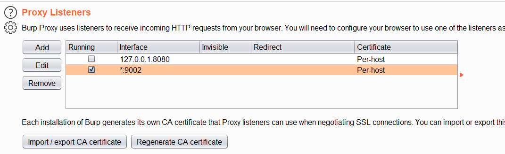
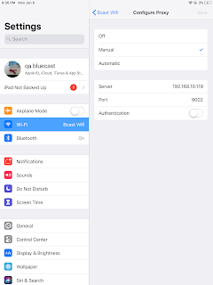

Hey guys today i will show you how to intercept http/https traffic from iOS applications using tool called Burpsuite.

First of all ensure that your system and iOS device are on the same network.

Now open Burpsuite on your system and listen on a port 9001 on all interface. (you can choose any port)

Now go to your iOS device and set a proxy under wifi option.

The next step is to download and install Burpsuite certificate for ssl interception, for that open **safari** and go to **http://burp** and download burp CA certificate.

- Install that certificate.(you will be prompted to install that profile)

For installing go to  **Settings > General > Profile & Device Management** and install portswigger profile.

To work properly you need to enable **Full Trust for the PortSwigger CA**.

- For that go to

  **Settings > General > About > Certificate Trust Settings**  and enable full trust for portswigger CA.
  
 Now you can intercept both http and https traffic without any security warnings.

 **NB: you can't intercept traffic of apps with ssl pinning implemented.**
