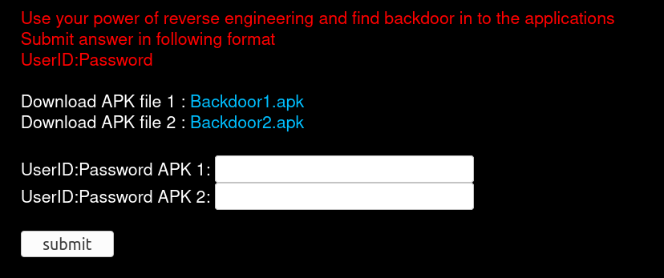
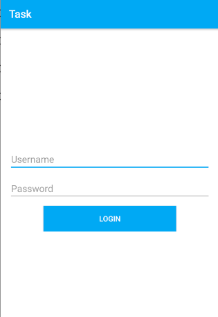
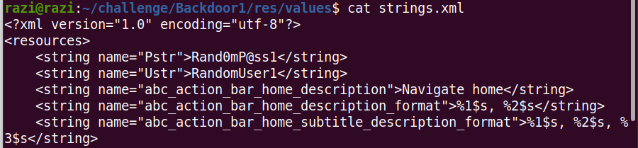
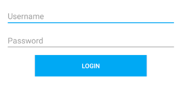
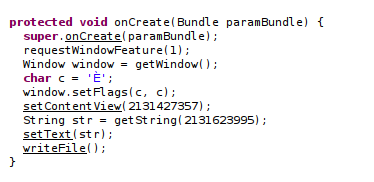
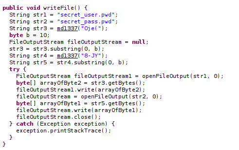
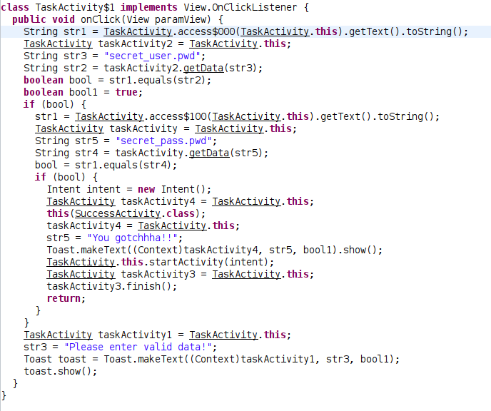
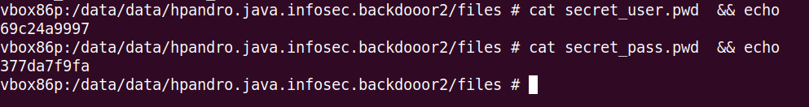

I was given two android application to find the flag from it.

The flag format is in **userid:password**.

#### Lets start..

* Application 1 : Backdoor1.apk

I installed the first application on emulator and the application asks for a username and password. I have to find out that.

First, i used **apktool** to decompile the android application.

~~~
apktool d Backdoor1.apk -o Backdoor1
~~~

After that i checked the strings.xml file, and i found some username and password from there.

But to confirm this i used **jadx** to reverse engineer the application and verified that the username and password found in strings.xml are the correct credentials needed by the application.

~~~
#Login function
public void onClick(View view) {
    if (!TaskActivity.this.edtUserName.getText().toString().equals(TaskActivity.this.getResources().getString(R.string.Ustr)) || !TaskActivity.this.edtPassword.getText().toString().equals(TaskActivity.this.getResources().getString(R.string.Pstr))) {
         Toast.makeText(TaskActivity.this, "Please enter valid data!", 1).show();
         return;
    }
    Intent mIntent = new Intent(TaskActivity.this, SuccessActivity.class);
    Toast.makeText(TaskActivity.this, "You gotchhha!!", 1).show();
    TaskActivity.this.startActivity(mIntent);
    TaskActivity.this.finish();
 }
~~~

This was an easy find. 

Note : **strings.xml file is an important file. most of the time some important information will be leaked there.**

**Flag : RandomUser1:Rand0mP@ss1**

* Application 2 : Backdoor2.apk

Installed the second application on emulator and it was similar to first challenge. After opening the application there is a login activity which asks for username 
and password. We have to find that.

As always i decompiled the application with **apktool**.

~~~
apktool d Backdoor2.apk -o Backdoor2
~~~

And i checked the strings.xml for any hardcoded username and password.

But nothing was there. After that i used **jadx** to reverse enginner the application and checked how this time login function is implemented.

As you can see the application creates 2 files "secret_user.pwd" and "secret_pass.pwd" on starting, and that two files contain username and password.

Now checking login function we can see that the entered username and password is checked against the content of that two files.

So this time the application stores the critical data in local file system.

**Flag : 69c24a9997:377da7f9fa**

Bye..
